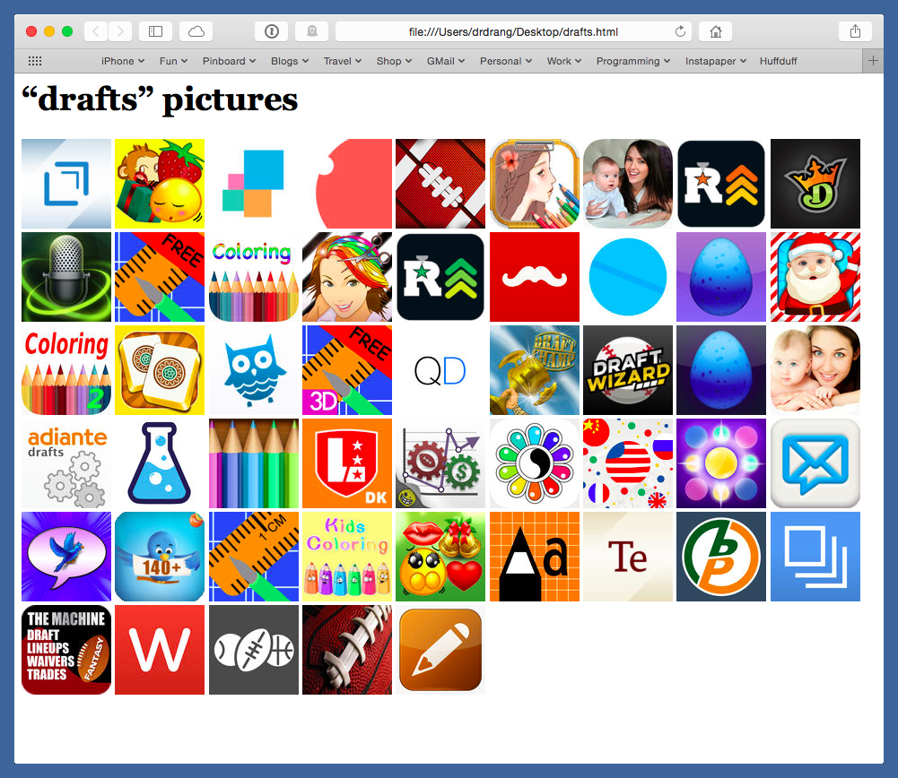

ipic
====

Python script for searching and downloading images from the iTunes, App, and Mac App Stores.

Installation
************

I install this `with pipsi <https://github.com/mitsuhiko/pipsi>`_:

.. code-block:: console

   git clone git@github.com:alexwlchan/ipic.git
   cd ipic
   pipsi install .

Usage
-----

.. code-block::

   ipic (-i | --ios)       <search_term>
   ipic (-m | --mac)       <search_term>
   ipic (-a | --album)     <search_term>
   ipic (-f | --film)      <search_term>
   ipic (-t | --tv)        <search_term>
   ipic (-b | --book)      <search_term>
   ipic (-n | --narration) <search_term>
   ipic (-h | --help)      <search_term>

Generate and open a web page of thumbnail images and links to larger images
for items in the iTunes/App/Mac App Stores.

The switches are

* ``-i``/``--ios``: iOS app
* ``-m``/``--mac``: Mac app
* ``-a``/``--album``: album
* ``-f``/``--film``: movie (mnemonic: film)
* ``-t``/``--tv``: TV show
* ``-b``/``--book``: book
* ``-n``/``--narration``: audiobook (mnemonic: narration)
* ``-h``/``--help``: show the help message

Only one switch is allowed. The HTML for the generated web page is saved to a temporary file.

Because the API usually returns several hits, `ipic` creates and opens a web page of thumbnail images that let you choose the one you want visually. Here's an example:

Each thumbnail is a link to a full-sized version of the image, 512×512 for apps and 600×600 otherwise. Hovering over a thumbnail will show the name of the item.
